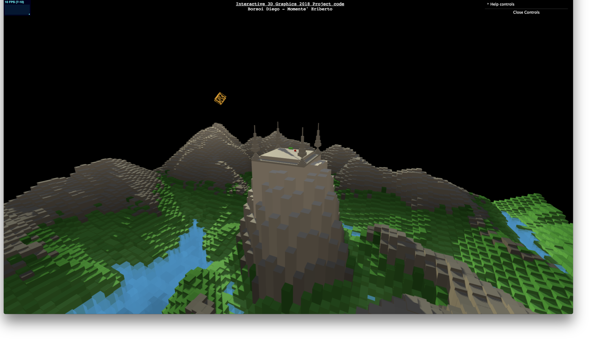
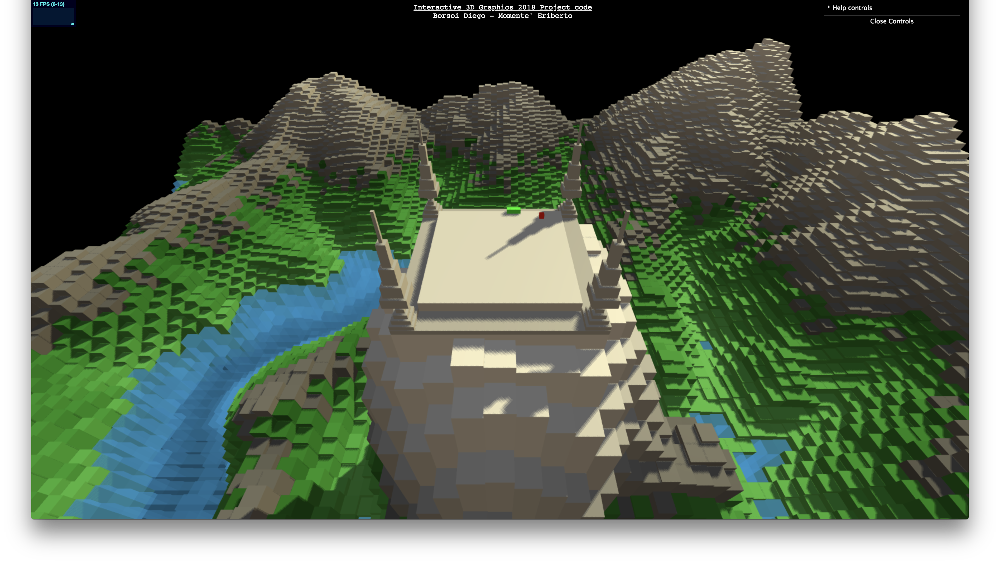
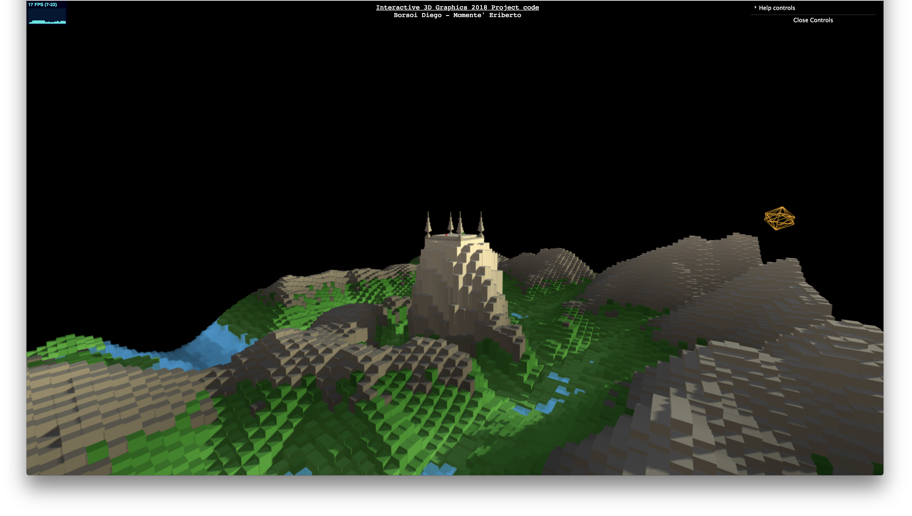

# Descrizione Generale
Il nostro progetto prevede l'implementazione del classico gioco dello Snake all'interno di un terreno montuoso. L'utente può liberamente spostarsi all'interno della scena con i classici comandi di zoom, rotazione e spostamento. Ha inoltre a disposizione il tasto ```enter``` per posizionarsi automaticamente davanti alla scena e le freccette direzionali della tastiera per muovere lo snake. La scena presenta inoltre un sole che ruota attorno al terreno.

Abbiamo implementato il gioco dello snake in modo che quando il serpente mangia la "mela", il suo corpo si allunga di un cubo. Quando il serpente mangia se stesso, il gioco automaticamente si resetta (e di conseguenza la lunghezza del corpo dello snake), mentre quando va a sbattere lungo la parete dell'arena devia automaticamente la sua traiettoria seguendone il perimetro in modo che se l'utente vuole spostarsi attraverso la scena può riprendere a giocare senza perdere i progressi fatti.



# Struttura del progetto
- da ```index.html``` si accede al risultato finale del progetto
- ```config.js``` contiene alcuni nostri parametri di configurazione
- ```favicon.ico``` è l'immagine visualizzata nella tab del browser
- ```journal.md``` una raccolta di tutti gli step fatti per la realizzazione del progetto
- ```./images``` contiene la Heightmap e immagini usate nel readme e nel jorunal
- ```./lib``` contiene le librerie di threejs usate
- ```./obj``` contiene oggetti js creati da noi e importati nella scena principale
- ```./StartingCode``` i codici di partenza dati alla consegna del progetto

# Fasi di implementazione
- implementazione logiche di gioco dello snake su un'arena custom
- esportazione dal sito https://terrain.party heightmap di machu-pichu e modifica delle tonalità di grigi con photoshop
- Generazione terreno a partire dalla heightmap
- modellazione e inserimento dell'arena di gioco nella scena
- inserimento dello snake sull'arena
- Colorazione terreni in base all'altezza
- Implementazione comandi da tastiera (enter e freccette direzionali)
- Creazione del sole e implementazione della sua orbita
- Inserimento ombre sulla scena

# Future features da implementare
 - Nel cartella ```./obj``` si notino i file ```tree.js``` e ```chicken.js```. Essi sono mesh rispettivamente di un albero e di una gallina che avremmo voluto inserire in modo casuale nella scena ma che per mancanza di tempo non siamo riusciti.
 - Implementare un'animazione di cubi per simulare il corso dell'acqua nel fiume